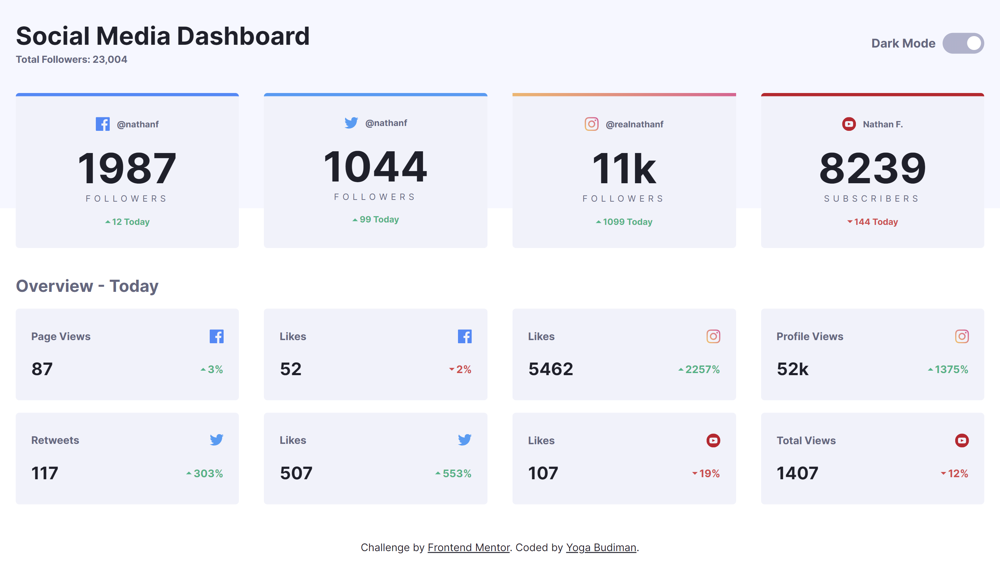
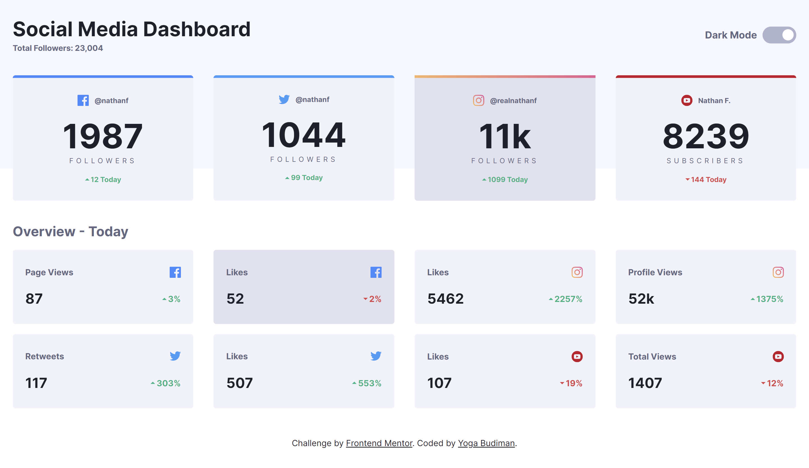
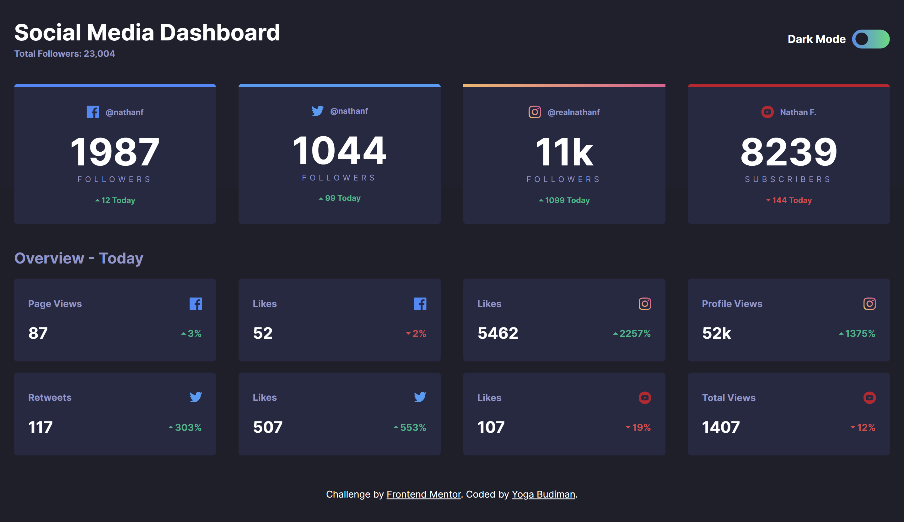

# Frontend Mentor - Social media dashboard with theme switcher solution

This is a solution to the [Social media dashboard with theme switcher challenge on Frontend Mentor](https://www.frontendmentor.io/challenges/social-media-dashboard-with-theme-switcher-6oY8ozp_H). Frontend Mentor challenges help you improve your coding skills by building realistic projects.

## Table of contents

- [Overview](#overview)
  - [The challenge](#the-challenge)
  - [Screenshot](#screenshot)
  - [Links](#links)
- [My process](#my-process)
  - [Built with](#built-with)
  - [What I learned](#what-i-learned)
  - [Continued development](#continued-development)
  - [Useful resources](#useful-resources)
- [Author](#author)
- [Acknowledgments](#acknowledgments)

**Note: Delete this note and update the table of contents based on what sections you keep.**

## Overview

### The challenge

Users should be able to:

- View the optimal layout for the site depending on their device's screen size
- See hover states for all interactive elements on the page
- Toggle color theme to their preference

### Screenshot

### Links

- Solution URL: (https://github.com/ygabdn29/social-media-dashboard)
- Live Site URL: (https://ygabdn29.github.io/social-media-dashboard/)

## My process

### Built with

- HTML5 markup
- CSS custom properties
- Flexbox
- CSS Grid
- Mobile-first workflow

### What I learned

In this challenge I learned how to create a toggle which can be used to switch the page theme. Using CSS custom properties to ease the switch between light theme and dark theme.

### Continued development

- Finding another approach to switch light and dark theme for the web page.

### Useful resources

- [MDN](https://developer.mozilla.org/en-US/)
- [Stackoverflow](https://stackoverflow.com/)
- [CSSTricks](https://css-tricks.com/) - Flexbox and Grid

## Author

- Yoga Budiman

## Acknowledgments

- [https://codepen.io/alvarotrigo/pen/abVPyaJ] - I'm using Álvaro's toggle switch from codepen.io to create the toggle needed for completing the design.
